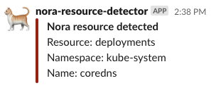

# nora-resource-detector

nora（野良） means stray in Japanese.

`nora-resource-detector` finds unmanaged resources in kubernetes cluster.

## image

### official

`public.ecr.aws/q1m5p9s1/nora-resource-detector` (amd64 linux only)

### build

`$ docker build -t <<your repository>>:<<tag>> .`

## methods

List of methods to determine if resources are managed.

### ArgoCD

Whether the resource is managed by ArgoCD.

### EKS Addon

Whether the resource is deployed by an EKS addon.

### OwnerReference

Whether the resource is dependent on others.

### VolumeClaimTemplate in STS

Whether the PVC was generated by volumeClaimTemplate in StatefulSet.

### Static

If you want to specify other static.

## flags

```
--config string
    Path to config file. (default "~/.nora/config.yaml")
--apiserver-url string
    URL for kubernetes api server.
--kubeconfig string
    Path to kubeconfig file.
```

## RBAC

Allows the executing account to `list` target resources.

## config

See also `example/config.yaml`

| Field                                     | Description                                                                                                                                                                               |
|-------------------------------------------|-------------------------------------------------------------------------------------------------------------------------------------------------------------------------------------------|
| targetResources                           | List of resource type names that search for Nora resources.                                                                                                                               |
| resourceManagers                          | Configs of components that manage resources.                                                                                                                                              |
| resourceManagers.argocd                   | Resources managed by ArgoCD are not detected as Nora.                                                                                                                                     |
| resourceManagers.argocd.instanceLabelKey  | Label key to determine which resources managed by ArgoCD. (Default if empty, see also [docs](https://argo-cd.readthedocs.io/en/stable/faq/#why-is-my-app-out-of-sync-even-after-syncing)) |
| resourceManagers.eksAddon                 | Resources managed by EKS addon are not detected as Nora.                                                                                                                                  |
| resourceManagers.ownerReference           | Resources dependent on others are not detected as Nora.                                                                                                                                   |
| resourceManagers.stsVolumeClaimTemplate   | PVC that created by volumeClaimTemplate of Statefulset are not detected as Nora.                                                                                                          |
| resourceManagers.serviceAccountToken      | Secrets created by serviceAccount are not detected as Nora.                                                                                                                               |
| resourceManagers.certificateSecret        | Secrets created by certificate (custom resource by cert-manager) are not detected as Nora. (effective when --enable-certificate-owner-ref is false)                                       |
| resourceManagers.static                   | Static settings to avoid detection as Nora other than the above.                                                                                                                          |
| resourceManagers.static.configs           | List of static settings.                                                                                                                                                                  |
| resourceManagers.static.configs.resource  | Resource type name.                                                                                                                                                                       |
| resourceManagers.static.configs.namespace | Resource namespace.                                                                                                                                                                       |
| resourceManagers.static.configs.names     | Resource name list.                                                                                                                                                                       |
| notifiers                                 | Configs for result notification.                                                                                                                                                          |
| notifiers.stdout                          | Whether to output to stdout.                                                                                                                                                              |
| notifiers.slack                           | Config to notify slack.                                                                                                                                                                   |
| notifiers.slack.token                     | Bot token to connect slack. (Can also be set by environment variable `SLACK_TOKEN`)                                                                                                       |
| notifiers.slack.channel                   | Slack channel name to send result.                                                                                                                                                        |
| notifiers.slack.username                  | Username when sending result.                                                                                                                                                             |
| notifiers.slack.icon_emoji                | Icon emoji when sending result.                                                                                                                                                           |
| notifiers.slack.icon_url                  | Icon image url when sending result.                                                                                                                                                       |

## Output

Now, output format is fixed and cannot be customized.

### stdout

```
{"Group":"apps","Resource":"deployments","Namespace":"kube-system","Name":"coredns"}
```

### slack


